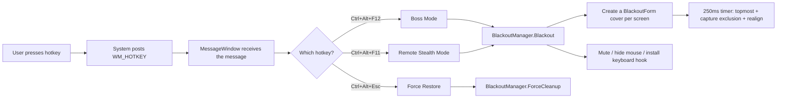

# BlackBossKey — Technical Deep Dive

> This document fully breaks down the implementation of BlackBossKey: which Windows API each feature uses, how the code is written, and the pitfalls encountered during development.
> Best read alongside the source `Program.cs` (single file, all logic commented).

## Table of Contents

- [Overall Architecture](#overall-architecture)
- [1. Global Hotkeys: RegisterHotKey](#1-global-hotkeys-registerhotkey)
- [2. Multi-Monitor Cover: Screen.AllScreens](#2-multi-monitor-cover-screenallscreens)
- [3. The Core of Remote Stealth: WDA_EXCLUDEFROMCAPTURE](#3-the-core-of-remote-stealth-wda_excludefromcapture)
- [4. Click-Through: How Input "Passes Through" the Cover](#4-click-through-how-input-passes-through-the-cover)
- [5. Keeping Topmost: Why You Can't Toggle the TopMost Property](#5-keeping-topmost-why-you-cant-toggle-the-topmost-property)
- [6. Audio Muting: WASAPI COM Interop](#6-audio-muting-wasapi-com-interop)
- [7. Mouse Control: The Trade-offs Between Three Hiding Methods](#7-mouse-control-the-trade-offs-between-three-hiding-methods)
- [8. Keyboard Interception: Low-Level Keyboard Hook WH_KEYBOARD_LL](#8-keyboard-interception-low-level-keyboard-hook-wh_keyboard_ll)
- [9. Stability Design: Atomic Initialization & Idempotent Cleanup](#9-stability-design-atomic-initialization--idempotent-cleanup)
- [10. Crash Recovery: Leftover State After Force-Kill](#10-crash-recovery-leftover-state-after-force-kill)
- [11. Mouse "Hidden but Usable": Blackout Above the Cursor](#11-mouse-hidden-but-usable-blackout-above-the-cursor)
- [12. Status Light](#12-status-light)
- [13. Dock Widget Compatibility: Hiding Other Topmost Windows](#13-dock-widget-compatibility-hiding-other-topmost-windows)
- [Pitfalls Summary Table](#pitfalls-summary-table)
- [Conclusion](#conclusion)

## Overall Architecture

The entire program is a **tray application with no main window**. All logic revolves around a single message chain:



The entry point has no `Form` — it inherits `ApplicationContext` instead, which is the standard WinForms tray-app pattern, avoiding a main window that is never shown:

```csharp
// Program.Main
ApplicationConfiguration.Initialize();          // Set DPI awareness mode
Application.Run(new HotkeyContext());          // ApplicationContext, no main window
```

`HotkeyContext` creates a hidden `MessageWindow` (inherits `NativeWindow`, not in the taskbar) that exists solely to receive hotkey messages, and attaches a `NotifyIcon` for the tray icon and right-click menu.

---

## 1. Global Hotkeys: RegisterHotKey

**API used**: `RegisterHotKey` / `UnregisterHotKey` (user32.dll)

How global hotkeys work: you register a "modifier + key" combination with the system, and afterwards, **regardless of which window has focus**, pressing the combination delivers a `WM_HOTKEY` message to your window.

```csharp
[DllImport("user32.dll", SetLastError = true)]
static extern bool RegisterHotKey(IntPtr hWnd, int id, uint fsModifiers, uint vk);

// Register: id is a custom number used to distinguish multiple hotkeys
RegisterHotKey(hWnd, 1, MOD_CONTROL | MOD_ALT, VK_F12);  // Ctrl+Alt+F12
RegisterHotKey(hWnd, 1+2, MOD_CONTROL | MOD_ALT, VK_ESCAPE); // Ctrl+Alt+Esc
```

The receiving side inherits `NativeWindow` and overrides `WndProc` to intercept the message:

```csharp
internal sealed class MessageWindow : NativeWindow
{
    protected override void WndProc(ref Message m)
    {
        if (m.Msg == 0x0312)          // WM_HOTKEY
        {
            _onHotKey(m.WParam.ToInt32());  // WParam is the registration id
            return;
        }
        base.WndProc(ref m);
    }
}
```

**Key details**:
- `RegisterHotKey` hotkeys have **higher priority than normal window messages**, so they fire even when focus is in Chrome, VS Code, or a fullscreen game.
- A failed registration (combination occupied by another program) returns `false`; the program doesn't crash, it degrades to tray-menu-only operation.
- If hotkey handling throws, the catch block must **restore the screen first, then show the error dialog** (see Section 9).

---

## 2. Multi-Monitor Cover: Screen.AllScreens

**API used**: `Screen.AllScreens` (System.Windows.Forms), `Screen.FromHandle`

The approach is straightforward: **create one borderless, pure-black form per monitor**, sized and positioned to exactly match that monitor's physical region.

```csharp
public BlackoutForm(Screen screen, bool clickThrough = false)
{
    _targetBounds = screen.Bounds;        // Full physical region of this display (incl. taskbar)
    FormBorderStyle = FormBorderStyle.None;  // No border
    StartPosition = FormStartPosition.Manual;
    Bounds = _targetBounds;               // Slap the size and position straight on
    BackColor = Color.Black;              // RGB(0,0,0) pure black
    ShowInTaskbar = false;                // Not in the taskbar
    TopMost = true;                       // Topmost
}
```

**Several easily-missed points**:

1. **Use `Screen.Bounds`, not `WorkingArea`**. `WorkingArea` excludes the taskbar region, which would leak the taskbar; `Bounds` is the whole physical pixel area of the screen and must be fully covered.
2. **Mixed DPI scaling**: with `<ApplicationHighDpiMode>PerMonitorV2</ApplicationHighDpiMode>` in the project file, `Screen.Bounds` returns physical pixels, so every screen is covered precisely.
3. **Real-time recalibration with `Screen.FromHandle(Handle)`**: after monitor hot-plug or resolution change, the form's Bounds go stale. The timer checks every 250ms:

```csharp
public void RealignIfNecessary()
{
    var screen = Screen.FromHandle(Handle);   // Which screen is this form on now
    if (screen.Bounds != _targetBounds)
    {
        _targetBounds = screen.Bounds;
        Bounds = _targetBounds;               // Follow the new layout
    }
}
```

4. **System event subscription**: when `SystemEvents.DisplaySettingsChanged` fires, destroy all old covers and rebuild for the new layout.

---

## 3. The Core of Remote Stealth: WDA_EXCLUDEFROMCAPTURE

**API used**: `SetWindowDisplayAffinity` (user32.dll)

This is the most core API in the whole project. It controls a window's "display affinity" — i.e. **where the window is allowed to be seen**:

| Flag | Meaning |
|---|---|
| `WDA_NONE` (0x0) | No restriction, visible everywhere |
| `WDA_MONITOR` (0x1) | Only shown on the display; appears as a black block elsewhere |
| `WDA_EXCLUDEFROMCAPTURE` (0x11) | **Only shown on the display; completely absent everywhere else** |

The key is `0x11`: a window with this flag **renders normally on the physical display**, but when DWM (Desktop Window Manager) composites the frame for any capture pipeline (DXGI Desktop Duplication, GDI, Windows Graphics Capture), **this window is cut right out**.

Result: physical screens go black, while in what the remote software sees, the cover simply doesn't exist — remote sees the real desktop underneath.

```csharp
const uint WDA_EXCLUDEFROMCAPTURE = 0x00000011;

[DllImport("user32.dll")]
static extern bool SetWindowDisplayAffinity(IntPtr hWnd, uint dwAffinity);

// Called after the window handle is created (must be after Show)
public void ApplyCaptureExclusion()
{
    Native.SetWindowDisplayAffinity(Handle, WDA_EXCLUDEFROMCAPTURE);
}
```

### Two fatal pitfalls

**Pitfall 1: a DWM restart silently drops this flag.**
When `explorer.exe` crashes and restarts, or the GPU driver resets, the DWM composition state is rebuilt, and the flag becomes **visually ineffective** (remote can see the cover again). Yet `GetWindowDisplayAffinity` still reports the flag as present (it lives in win32k, not dwm). So you **cannot optimize by "check if it's still set, then decide whether to set it"** — you must blindly re-apply it on a timer, unconditionally:

```csharp
// Inside the 250ms timer, re-set unconditionally, no "is it needed" check
if (remoteMode) form.ApplyCaptureExclusion();
```

This lesson came from the practical write-up of the [LZong-tw/turn-off-screen](https://github.com/LZong-tw/turn-off-screen) project.

**Pitfall 2: Windows version requirement.**
`WDA_EXCLUDEFROMCAPTURE` was introduced in **Windows 10 2004 (Build 19041)**. On earlier versions it degrades to `WDA_MONITOR` (a black block in capture instead of being excluded) — remote sees "a black square on the desktop," a completely different effect.

### Why Boss Mode doesn't use this flag

Boss Mode's purpose is "keep people nearby from seeing," so the cover **should be captured** (screenshots and recordings come out black too — safer). Only Remote Stealth Mode needs the cover to be "invisible to capture." The two modes are essentially the same cover window + different flag combinations.

---

## 4. Click-Through: How Input "Passes Through" the Cover

In Remote Stealth Mode the cover sits on the screen, but clicks and drags from the phone must act on the real windows. This needs a combination of Windows **extended window styles**:

```csharp
protected override CreateParams CreateParams
{
    get
    {
        var cp = base.CreateParams;
        cp.ExStyle |= WS_EX_TOOLWINDOW    // 0x80:   not in the Alt-Tab list
                   |  WS_EX_TOPMOST       // 0x8:    topmost
                   |  WS_EX_NOACTIVATE    // 0x8000000: clicking doesn't steal focus
                   |  WS_EX_TRANSPARENT   // 0x20:   transparent to mouse input
                   |  WS_EX_LAYERED;      // 0x80000: layered window (the standard partner for click-through)
        return cp;
    }
}
```

**`WS_EX_LAYERED | WS_EX_TRANSPARENT` is the classic click-through combo**. A layered window also needs its attributes set before it will render (otherwise the whole window shows nothing):

```csharp
[DllImport("user32.dll")]
static extern bool SetLayeredWindowAttributes(IntPtr hWnd, uint crKey, byte bAlpha, uint dwFlags);

// alpha=255 fully opaque — we want click-through only, not translucency
SetLayeredWindowAttributes(Handle, 0, 255, 2 /* LWA_ALPHA */);
```

**Pitfall encountered**: in V6.1, mouse clicks were "all swallowed." Investigation revealed the cover's `WndProc` unconditionally intercepted `WM_NCHITTEST` and returned `HTCLIENT` (used in Boss Mode to block accidental clicks); in click-through mode this code **precisely disabled the click-through effect**. Fix: don't intercept `WM_NCHITTEST` in click-through mode; let the system's default handling take over:

```csharp
protected override void WndProc(ref Message m)
{
    const int WM_NCHITTEST = 0x0084;
    // Only swallow the hit test in boss mode (non-click-through); click-through must use default
    if (m.Msg == WM_NCHITTEST && !_clickThrough) { m.Result = (IntPtr)1; return; }
    base.WndProc(ref m);
}
```

**Lesson**: `WS_EX_TRANSPARENT` alone is unreliable for click-through and must be paired with `WS_EX_LAYERED`; and **returning a custom value for `WM_NCHITTEST` interferes with click-through**.

---

## 5. Keeping Topmost: Why You Can't Toggle the TopMost Property

The cover must stay above all windows at all times. But "re-asserting topmost" has a counter-intuitive pitfall.

The initial approach:

```csharp
// ❌ Wrong: briefly demotes the cover each cycle
form.TopMost = false;
form.TopMost = true;
```

The problem: the instant `TopMost = false` happens, the cover is **genuinely demoted**. If another topmost window exists at that moment (a remote app's connection banner, a floating toolbar), it jumps above the cover — manifesting as **periodic flicker** in the bottom-right corner.

The correct approach: `SetWindowPos` directly to `HWND_TOPMOST`, **without ever passing through a demoted intermediate state**:

```csharp
[DllImport("user32.dll")]
static extern bool SetWindowPos(IntPtr hWnd, IntPtr hWndInsertAfter,
    int x, int y, int cx, int cy, uint flags);

// HWND_TOPMOST = -1; SWP_NOMOVE|NOSIZE|NOACTIVATE = change z-order only, no move, no focus
public void AssertTopmost()
{
    Native.SetWindowPos(Handle, Native.HWND_TOPMOST, 0, 0, 0, 0,
        Native.SWP_NOMOVE | Native.SWP_NOSIZE | Native.SWP_NOACTIVATE | Native.SWP_SHOWWINDOW);
}
```

This runs every 250ms (alongside capture-exclusion re-apply); the cost is negligible, but it guarantees the cover never has a "vulnerable" moment.

---

## 6. Audio Muting: WASAPI COM Interop

**API used**: Windows Core Audio (MMDevice API + WASAPI endpoint volume interface)

Windows audio control doesn't go through ordinary Win32 APIs — it goes through a **COM interface chain**:

```
MMDeviceEnumerator (device enumerator)
    → GetDefaultAudioEndpoint(eRender, eMultimedia) to get the default output device
        → IMMDevice.Activate(IAudioEndpointVolume) to activate the volume control interface
            → GetMute() / SetMute(bool) to read/write mute state
```

In C# you declare the interop definitions for these COM interfaces via `[ComImport]`:

```csharp
// The COM class of the device enumerator
[ComImport, Guid("BCDE0395-E52F-467C-8E3D-C4579291692E")]
class MMDeviceEnumerator { }

// The enumerator interface (vtable order must exactly match the native definition; not one may be omitted)
[ComImport, Guid("A95664D2-9614-4F35-A746-DE8DB63617E6"),
 InterfaceType(ComInterfaceType.InterfaceIsIUnknown)]
interface IMMDeviceEnumerator
{
    [PreserveSig] int EnumAudioEndpoints(int dataFlow, int stateMask, out IntPtr devices);
    [PreserveSig] int GetDefaultAudioEndpoint(int dataFlow, int role, out IMMDevice device);
    // ... even unused later methods must be declared in order, or the vtable misaligns
}

// The endpoint volume interface: SetMute / GetMute are at positions 12 and 13
[ComImport, Guid("5CDF2C82-841E-4546-9722-0CF74078229A"),
 InterfaceType(ComInterfaceType.InterfaceIsIUnknown)]
interface IAudioEndpointVolume
{
    // Declare the first 11 methods in vtable order (RegisterControlChangeNotify...)
    [PreserveSig] int SetMute(bool mute, ref Guid eventContext);
    [PreserveSig] int GetMute(out bool mute);
    // ...
}
```

**Three COM-interop pitfalls**:

1. **vtable order must not be wrong**. The method order in an `InterfaceIsIUnknown` interface is the COM virtual function table order; skipping or adding/removing one method makes all subsequent calls hit the wrong function (or crash). Even if you only use `SetMute/GetMute`, you must fully declare the 11 preceding methods.
2. **You cannot write method bodies inside a COM interface**. The compiler reports CS0423 "must be external or abstract." Convenience wrappers (e.g. `GetMuteSafe()`) go in a separate extension class.
3. **Instantiation method**. A direct `(IMMDeviceEnumerator)new MMDeviceEnumerator()` cast fails to compile under .NET 10 with CS0030; create it at runtime instead:

```csharp
Type? t = Type.GetTypeFromCLSID(new Guid("BCDE0395-E52F-467C-8E3D-C4579291692E"));
var enumerator = (IMMDeviceEnumerator)Activator.CreateInstance(t);
enumerator.GetDefaultAudioEndpoint(0 /*eRender*/, 1 /*eMultimedia*/, out IMMDevice device);

Guid iid = new("5CDF2C82-841E-4546-9722-0CF74078229A");  // IID_IAudioEndpointVolume
device.Activate(ref iid, 0x17 /*CLSCTX_ALL*/, IntPtr.Zero, out object obj);
var volume = (IAudioEndpointVolume)obj;
```

**Mute save/restore logic**: before blackout, `GetMute()` remembers the original state, then `SetMute(true)`; on restore, `SetMute(originalState)`. So "if it was muted before it stays muted; if it had sound, it comes back" — rather than brutally unmuting.

---

## 7. Mouse Control: The Trade-offs Between Three Hiding Methods

| Method | API | Scope | Use case |
|---|---|---|---|
| `ShowCursor(FALSE)` | user32 | Effective **only on this thread's windows** | Boss Mode (cover is this program's window) |
| Cover `Cursor = None` | WinForms | Only on that form | Insufficient (see below) |
| `SetSystemCursor` replacement | user32 | **System-wide** | Was used for remote mode, later reverted |

`ShowCursor` works via a **per-thread counter**: each FALSE call decrements it, each TRUE call increments; the cursor is hidden when the counter is < 0. So you must loop until it's definitely negative to guarantee hiding:

```csharp
// Hide: loop until definitely hidden
int count;
do { count = ShowCursor(false); } while (count >= 0);

// Restore: loop until definitely shown
do { count = ShowCursor(true); } while (count < 0);
```

**Why remote mode can't use it**: the Remote Stealth cover is click-through, so logically the mouse hovers over the **desktop window** (owned by another thread), and `ShowCursor` has no effect on other threads. We once switched to `SetSystemCursor` to replace all 13 system cursors with blank ones, but the side effect was that **the cursor drawn by the remote software also vanished** — the phone side couldn't operate. So it was reverted per user request; remote mode does not hide the mouse.

Leaving one cursor visible moving over the black physical screen is a trade-off between "perfect privacy" and "remote usability."

---

## 8. Keyboard Interception: Low-Level Keyboard Hook WH_KEYBOARD_LL

Pressing Win while blacked out pops the Start Menu — a **topmost window** that fights the cover for z-order. Suppressing it with topmost is only a band-aid; the right approach is to swallow the key at the system level.

**API used**: `SetWindowsHookEx(WH_KEYBOARD_LL, ...)` low-level keyboard hook

```csharp
_hook = SetWindowsHookEx(13 /*WH_KEYBOARD_LL*/, proc, GetModuleHandle(null), 0);
```

In the hook callback, check the key; return 1 (consume it) to intercept, otherwise call `CallNextHookEx` to pass it to the system:

```csharp
IntPtr HookProc(int nCode, IntPtr wParam, IntPtr lParam)
{
    var info = Marshal.PtrToStructure<KBDLLHOOKSTRUCT>(lParam);
    bool winDown  = GetAsyncKeyState(VK_LWIN) < 0 || GetAsyncKeyState(VK_RWIN) < 0;
    bool ctrlDown = GetAsyncKeyState(VK_CONTROL) < 0;
    bool altDown  = (info.flags & LLKHF_ALTDOWN) != 0;

    // 1. The Win key itself: swallow both press and release (Start Menu pops on release)
    if (info.vkCode is VK_LWIN or VK_RWIN) return 1;
    // 2. Win + any key
    if (winDown) return 1;
    // 3. Ctrl+Esc (also opens Start Menu), but let through the Ctrl+Alt+Esc force-restore hotkey
    if (info.vkCode == VK_ESCAPE && ctrlDown && !altDown) return 1;
    // 4. Alt+Tab / Alt+Esc task switcher (let through combos that include Ctrl)
    if (altDown && !ctrlDown && info.vkCode is VK_TAB or VK_ESCAPE) return 1;

    return CallNextHookEx(_hook, nCode, wParam, lParam);
}
```

**Three key details**:

1. **Store the delegate in a field**. The `SetWindowsHookEx` callback is a delegate; if you pass a temporary variable and GC collects it, the hook silently stops working or crashes.
2. **Let your own hotkey through**. When swallowing Esc/Tab in the hook, you must exclude the `Ctrl+Alt+Esc` force-restore hotkey — otherwise the hook eats your own hotkey and the user is locked in.
3. **`GetAsyncKeyState` returns short**; test "pressed" with `(state & 0x8000) != 0` (the high bit).

**Boundary**: `Ctrl+Alt+Del` and `Win+L` are system secure sequences handled by a kernel path — **no user-mode program can intercept them**. That is Windows' design floor.

---

## 9. Stability Design: Atomic Initialization & Idempotent Cleanup

This is the single most important lesson of the project, and it came from a real incident.

### The incident

In V5, the `GetModuleHandle` P/Invoke declaration specified the wrong DLL (`user32.dll` instead of `kernel32.dll`), so installing the keyboard hook always threw `EntryPointNotFoundException`. The exception was thrown **after the cover was already showing, the mouse already hidden, and audio already muted** — and the restore function had an `if (!active) return;` state guard. Since the state flag hadn't been set to true yet, cleanup was skipped entirely. Result: **cover on screen + invisible cursor + error dialog buried behind the cover, and the force-restore hotkey also dead** — the user had to force-reboot.

### Two design principles (followed since V6)

**Principle 1: sequences that mutate external state must be atomic.**

```csharp
public void Blackout(bool remoteMode = false)
{
    try
    {
        _kbBlocker.Start();          // Do the most-failure-prone step first
        // ... save cursor / mute / create cover / start timer ...
        _active = true;
    }
    catch (Exception ex)
    {
        Logger.Write("Initialization failed, rolling back: " + ex);
        ForceCleanup();              // No matter how far we got, roll back everything
        throw;                       // The screen is already restored; report upward
    }
}
```

This makes the **half-initialized state (cover on screen but state flag unset) structurally impossible**.

**Principle 2: the restore function must never early-return on a state guard.**

```csharp
// ❌ The V5 way: during half-init _active=false, so cleanup is skipped
public void Restore()
{
    if (!_active) return;   // ← this very line trapped the user
    ...
}

// ✅ The V6 way: unconditional idempotent cleanup — clear whatever remains
public void ForceCleanup()
{
    // stop timers, close cover, unhook, restore audio, restore cursor...
    // each step in its own try/catch, so one failure doesn't stop the rest
}

public void Restore() => ForceCleanup();
```

**Companion fix**: error dialogs don't use WinForms' `MessageBox.Show` (it gets buried **behind** the topmost cover — invisible and undismissable). Use `MessageBoxW` with system-level flags:

```csharp
[DllImport("user32.dll", CharSet = CharSet.Unicode)]
static extern int MessageBoxW(IntPtr hWnd, string text, string caption, uint type);

// MB_TOPMOST=0x40000 topmost | MB_SETFOREGROUND=0x10000 foreground | MB_SYSTEMMODAL=0x1000 system
MessageBoxW(IntPtr.Zero, text, "BlackBossKey",
    0x0 | 0x10 | 0x40000 | 0x10000);   // OK + error icon + always on top
```

---

## 10. Crash Recovery: Leftover State After Force-Kill

When a process is force-killed via `taskkill /F` or Task Manager, the `ProcessExit` callback **is not guaranteed to run**. If the kill happens while Boss Mode has the audio muted, the system stays muted.

Fix: **on-disk flag + self-heal at startup**.

```csharp
// Write the flag file when muting
StateFile.SetMuteFlag();   // %LOCALAPPDATA%\BlackBossKey\mute_was_set.flag

// Check on every startup: flag present = last run didn't exit cleanly
public static void CheckAndRestore()
{
    if (StateFile.Exists())
    {
        Logger.Write("Crash leftovers detected, restoring audio...");
        AudioController.SetMute(false);   // restore
        StateFile.Clear();                // clear the flag
    }
}
```

Tested end-to-end: force-kill → mute stays True → restart program → log shows "Crash leftovers detected" → mute auto-restored to False. Cursors have a parallel fallback via the `--restore-cursors` emergency restore command.

---

## 11. Mouse "Hidden but Usable": Blackout Above the Cursor

Requirements evolved: Boss Mode was originally "hide mouse + cover swallows clicks," then the user wanted the **cursor invisible but the mouse still usable**.

Final solution = a combination of two mechanisms:

1. **Cover click-through** (`WS_EX_LAYERED | WS_EX_TRANSPARENT`): all mouse input passes through the cover to the windows below, so the mouse "works";
2. **System cursor replacement** (`SetSystemCursor` replaces all 13 system cursors with a blank cursor): the cursor "can't be seen."

Why not `ShowCursor`: once the cover is click-through, the cursor logically hovers over **windows of other processes**, and the `ShowCursor` counter only affects windows owned by this thread — this is the same root cause as the early Remote Stealth "mouse unusable/invisible" problem. System-level replacement (`SetSystemCursor` + restore via `SystemParametersInfo(SPI_SETCURSORS)`) isn't limited by window ownership.

Companion self-heal: while blacked out, write a `cursor_was_hidden.flag` marker; if a force-kill leaves it behind, next startup detects it and calls `ForceRestore()` to unconditionally restore system cursors.

| Mode | Cursor | Mouse input | Audio |
|---|---|---|---|
| Boss Mode | System-level hidden (blackout covers the mouse) | Click-through, usable | Muted |
| Remote Stealth Mode | Visible (the phone must see it) | Click-through, usable | Untouched |

## 12. Status Light

A 28×28 dot in the top-right corner of each screen, `TransparencyKey = Color.Fuchsia` punches out a transparent background, and `OnPaint` draws a color by state — **red = blackout on (persistent), green = off (fades out after 5 s)**. The fade lowers the form's `Opacity` frame by frame (a 200ms timer; hold full brightness for the first 5 s, then drop 0.1 per 200ms, ~1s to fade, then `Hide()`). Red/green switching uses `SetOn` → `Invalidate` to redraw; **no capture exclusion**, so it's visible in the remote view too. It's click-through as well and participates in the 250ms topmost re-assertion; `EnsureLights` rebuilds it when the display layout changes.

**WinForms pitfalls**:
- `Cursors.None` doesn't exist (discovered at compile time); hiding the cursor must go through Win32.
- Assigning `TransparencyKey` automatically adds `WS_EX_LAYERED` to the window — no need to set it manually.

**In-app icon generation**: draw onto a `Bitmap` → `GetHicon()` → `Icon.Clone()`; no .ico resource file needed.

---

## 13. Dock Widget Compatibility: Hiding Other Topmost Windows

A desktop dock widget (e.g. DesktopDock) is a **topmost WPF window**; during blackout it floats above the pure-black cover, breaking the full-black effect, and in Remote Stealth Mode it's even captured by the phone side.

Approach: **don't patch the widget itself**. During blackout, hide it with `ShowWindow(SW_HIDE)`, and restore it with `ShowWindow(SW_SHOW)` on exit. This way it works regardless of how the widget is updated.

```csharp
internal static class DockHider
{
    private const string DockProcessName = "DesktopDock";

    // Enumerate all windows, hide & record the visible top-level windows belonging to DesktopDock
    public static void Hide()
    {
        var pids = Process.GetProcessesByName(DockProcessName)
                          .Select(p => (uint)p.Id).ToHashSet();
        if (pids.Count == 0) return;

        EnumWindows((h, l) =>
        {
            GetWindowThreadProcessId(h, out uint pid);
            if (pids.Contains(pid) && IsWindowVisible(h))
            {
                ShowWindow(h, SW_HIDE);               // 0 = hide
                _hiddenHwnds.Add(h);                  // record it; on restore only show what we hid
            }
            return true;
        }, IntPtr.Zero);
    }

    public static void Restore()
    {
        foreach (var h in _hiddenHwnds)
            if (IsWindow(h)) ShowWindow(h, SW_SHOW);  // 5 = show
        _hiddenHwnds.Clear();
    }
}
```

**Key design points**:
1. **Match by process name** (`Process.GetProcessesByName`), not window title — still works if the widget is renamed.
2. **Only hide visible windows; only restore windows we hid ourselves** — doesn't interfere with the widget's own show/hide logic.
3. **Pairs with the 250ms timer**: if the widget is relaunched by its watchdog or a new window appears during blackout, `EnsureHidden()` in the timer hides it again.
4. Hide the top-level windows rather than killing the process — the widget's process keeps running, so its watchdog auto-start logic isn't triggered.

---

## Pitfalls Summary Table

| # | Pitfall | Symptom | Fix |
|---|---|---|---|
| 1 | `GetModuleHandle` wrong DLL (user32→kernel32) | `EntryPointNotFoundException` → half-init deadlock | Correct DLL + atomic rollback |
| 2 | Method bodies inside COM interfaces | CS0423 compile error | Move convenience wrappers to an extension class |
| 3 | `(IInterface)new CoClass()` cast | CS0030 compile error | `GetTypeFromCLSID` + `Activator.CreateInstance` |
| 4 | WinForms `Cursors.None` doesn't exist | CS0117 compile error | Use Win32 `ShowCursor`/`SetSystemCursor` |
| 5 | Re-asserting topmost via `TopMost=false/true` | Periodic flicker bottom-right | Lossless `SetWindowPos(HWND_TOPMOST)` re-assert |
| 6 | DWM restart drops `WDA_EXCLUDEFROMCAPTURE` | Remote suddenly sees the cover | Blind unconditional re-set every 250ms |
| 7 | `WndProc` intercepting `WM_NCHITTEST` | Click-through swallows all clicks | Let default handling through in click-through mode |
| 8 | `WS_EX_TRANSPARENT` alone | Unreliable click-through | Standard `LAYERED + TRANSPARENT` combo |
| 9 | Restore guarded by `if(!_active) return` | Half-init state traps the user | Unconditional idempotent `ForceCleanup` |
| 10 | Force-kill leaves mute on | Audio stays muted forever | Flag file + startup self-heal |
| 11 | `MessageBox` buried behind cover | Error box invisible/undismissable | `MessageBoxW` + `MB_TOPMOST` |

---

## Conclusion

There's no exotic technology here — the project is entirely composed of **mature Windows APIs**. The real difficulty lies in:

1. **Correctness of the combination** — the order, timing, and side effects when a dozen APIs interact;
2. **Designing the failure paths** — anyone can write the happy path; the hard part is what happens when it crashes / gets killed / a monitor is unplugged;
3. **Real user feedback** — several key fixes (cursor, click-through, status light) came from problems exposed in actual use.

Stars / forks / issues welcome: [github.com/milkloon-777/BlackBossKey](https://github.com/milkloon-777/BlackBossKey)
