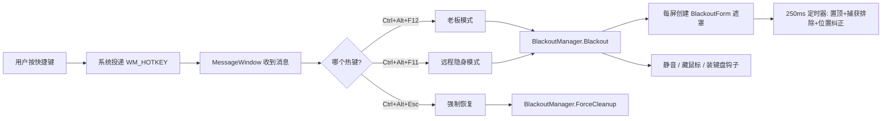

# BlackBossKey 技术原理详解

> 本文完整拆解 BlackBossKey 的实现原理：每个功能用了什么 Windows API、代码怎么写的、开发过程中踩了哪些坑。
> 配合源码 `Program.cs`（单文件，全部逻辑带注释）阅读效果最佳。

## 目录

- [整体架构](#整体架构)
- [1. 全局热键：RegisterHotKey](#1-全局热键registerhotkey)
- [2. 多显示器遮罩：Screen.AllScreens](#2-多显示器遮罩screenallscreens)
- [3. 远程隐身的核心：WDA_EXCLUDEFROMCAPTURE](#3-远程隐身的核心wda_excludefromcapture)
- [4. 点击穿透：鼠标和键盘怎么"穿过"遮罩](#4-点击穿透鼠标和键盘怎么穿过遮罩)
- [5. 置顶维持：为什么不能用 TopMost 属性切换](#5-置顶维持为什么不能用-topmost-属性切换)
- [6. 音频静音：WASAPI COM 互操作](#6-音频静音wasapi-com-互操作)
- [7. 鼠标控制：三种隐藏方式的取舍](#7-鼠标控制三种隐藏方式的取舍)
- [8. 键盘拦截：低级键盘钩子 WH_KEYBOARD_LL](#8-键盘拦截低级键盘钩子-wh_keyboard_ll)
- [9. 稳定性设计：原子化初始化与幂等清理](#9-稳定性设计原子化初始化与幂等清理)
- [10. 崩溃恢复：强杀进程后的状态残留](#10-崩溃恢复强杀进程后的状态残留)
- [11. 其他细节](#11-其他细节)
- [踩坑总结表](#踩坑总结表)

## 整体架构

整个程序是一个**无主窗口的托盘应用**，所有逻辑围绕一条消息链路展开：



程序入口没有 `Form`，而是继承 `ApplicationContext`——这是 WinForms 托盘应用的标准写法，避免创建根本不显示的主窗口：

```csharp
// Program.Main
ApplicationConfiguration.Initialize();          // 设置 DPI 感知模式
Application.Run(new HotkeyContext());          // ApplicationContext，无主窗口
```

`HotkeyContext` 里创建一个隐藏的 `MessageWindow`（继承 `NativeWindow`，不占任务栏）专门接收热键消息，再用 `NotifyIcon` 挂托盘图标和右键菜单。

---

## 1. 全局热键：RegisterHotKey

**用的 API**：`RegisterHotKey` / `UnregisterHotKey`（user32.dll）

全局热键的原理：向系统注册"某修饰键+某键"的组合，之后**无论焦点在哪个窗口**，按下组合键时系统都会向你的窗口投递一条 `WM_HOTKEY` 消息。

```csharp
[DllImport("user32.dll", SetLastError = true)]
static extern bool RegisterHotKey(IntPtr hWnd, int id, uint fsModifiers, uint vk);

// 注册：id 是自定义编号，用来区分多个热键
RegisterHotKey(hWnd, 1, MOD_CONTROL | MOD_ALT, VK_F12);  // Ctrl+Alt+F12
RegisterHotKey(hWnd, 1+2, MOD_CONTROL | MOD_ALT, VK_ESCAPE); // Ctrl+Alt+Esc
```

接收端继承 `NativeWindow`，重写 `WndProc` 拦截消息：

```csharp
internal sealed class MessageWindow : NativeWindow
{
    protected override void WndProc(ref Message m)
    {
        if (m.Msg == 0x0312)          // WM_HOTKEY
        {
            _onHotKey(m.WParam.ToInt32());  // WParam 就是注册时的 id
            return;
        }
        base.WndProc(ref m);
    }
}
```

**关键细节**：
- `RegisterHotKey` 的热键**优先级高于普通窗口消息**，所以即使焦点在 Chrome、VS Code、全屏游戏里也能触发。
- 注册失败（组合键被别的程序占了）会返回 `false`，程序不崩溃，降级为纯托盘菜单操作。
- 热键处理如果抛异常，必须在 catch 里**先恢复屏幕再弹错误框**（见第 9 节）。

---

## 2. 多显示器遮罩：Screen.AllScreens

**用的 API**：`Screen.AllScreens`（System.Windows.Forms）、`Screen.FromHandle`

做法很直接：**每块显示器创建一个无边框、纯黑背景的窗体**，尺寸和位置与该显示器的物理区域完全重合。

```csharp
public BlackoutForm(Screen screen, bool clickThrough = false)
{
    _targetBounds = screen.Bounds;        // 该显示器的完整物理区域（含任务栏）
    FormBorderStyle = FormBorderStyle.None;  // 无边框
    StartPosition = FormStartPosition.Manual;
    Bounds = _targetBounds;               // 尺寸位置直接怼上去
    BackColor = Color.Black;              // RGB(0,0,0) 纯黑
    ShowInTaskbar = false;                // 不出现在任务栏
    TopMost = true;                       // 置顶
}
```

**几个容易忽略的点**：

1. **用 `Screen.Bounds` 而不是 `WorkingArea`**。`WorkingArea` 会排除任务栏区域，导致任务栏露出来；`Bounds` 是整块屏幕的物理像素区域，必须全覆盖。
2. **不同 DPI 缩放**：`Screen.Bounds` 在 PerMonitorV2 DPI 模式下返回的就是物理像素，配合项目文件里的 `<ApplicationHighDpiMode>PerMonitorV2</ApplicationHighDpiMode>`，每块屏都能精确覆盖。
3. **`Screen.FromHandle(Handle)` 实时校准**：显示器热插拔或改分辨率后，窗体的 Bounds 会失效。定时器里每 250ms 检查一次：

```csharp
public void RealignIfNecessary()
{
    var screen = Screen.FromHandle(Handle);   // 这个窗体现在位于哪块屏
    if (screen.Bounds != _targetBounds)
    {
        _targetBounds = screen.Bounds;
        Bounds = _targetBounds;               // 跟着新布局走
    }
}
```

4. **系统事件订阅**：`SystemEvents.DisplaySettingsChanged` 触发时，销毁全部旧遮罩、按新布局重建。

---

## 3. 远程隐身的核心：WDA_EXCLUDEFROMCAPTURE

**用的 API**：`SetWindowDisplayAffinity`（user32.dll）

这是整个项目最核心的一个 API。它控制窗口内容的"显示亲和性"——即窗口**能在哪些地方被看到**：

| 标志值 | 含义 |
|---|---|
| `WDA_NONE` (0x0) | 无限制，到处可见 |
| `WDA_MONITOR` (0x1) | 只在显示器上显示，其他地方显示为黑块 |
| `WDA_EXCLUDEFROMCAPTURE` (0x11) | **只在显示器上显示，其他地方完全不存在** |

关键在 `0x11`：设置了它的窗口**在物理显示器上正常渲染**，但 DWM（桌面窗口管理器）在合成画面给任何捕获管线（DXGI Desktop Duplication、GDI、Windows Graphics Capture）时，**直接把这个窗口抠掉**。

于是：物理屏黑，远程软件看到的画面里遮罩根本不存在——远程看到的就是遮罩下面的真实桌面。

```csharp
const uint WDA_EXCLUDEFROMCAPTURE = 0x00000011;

[DllImport("user32.dll")]
static extern bool SetWindowDisplayAffinity(IntPtr hWnd, uint dwAffinity);

// 窗口句柄创建后调用（必须在 Show 之后）
public void ApplyCaptureExclusion()
{
    Native.SetWindowDisplayAffinity(Handle, WDA_EXCLUDEFROMCAPTURE);
}
```

### 两个致命的坑

**坑 1：DWM 重启会静默丢弃这个标志。**
`explorer.exe` 崩溃重启、显卡驱动重置等场景会重建 DWM 合成状态，此时标志**视觉上失效**（远程又能看到遮罩了），但 `GetWindowDisplayAffinity` 查询仍报告标志存在（标志存在 win32k 里，不在 dwm 里）。所以**不能用"查一下还在不在再决定要不要设"的优化**——必须定时无条件盲重设：

```csharp
// 250ms 定时器里，无条件重设，不做任何"是否需要"的判断
if (remoteMode) form.ApplyCaptureExclusion();
```

这个教训来自 [LZong-tw/turn-off-screen](https://github.com/LZong-tw/turn-off-screen) 项目的实践总结。

**坑 2：Windows 版本要求。**
`WDA_EXCLUDEFROMCAPTURE` 从 **Windows 10 2004（Build 19041）** 才引入。更早的版本上设置它会降级为 `WDA_MONITOR`（捕获中显示黑块而不是被排除）——远程看到的就是"桌面上一块黑"，效果完全不同。

### 为什么老板模式不用这个标志

老板模式的目的是"防旁边的人看到"，遮罩**就该被捕获到**（截图、录屏也都是黑的，更保险）。只有远程隐身模式才需要遮罩"在捕获里隐身"。两种模式本质是同一套遮罩窗口 + 不同标志组合。

---

## 4. 点击穿透：鼠标和键盘怎么"穿过"遮罩

远程隐身模式下，遮罩盖在屏幕上，但手机端的点击、拖动必须能作用到真实窗口。这需要 Windows 的**扩展窗口样式**组合：

```csharp
protected override CreateParams CreateParams
{
    get
    {
        var cp = base.CreateParams;
        cp.ExStyle |= WS_EX_TOOLWINDOW    // 0x80:   不进 Alt-Tab 列表
                   |  WS_EX_TOPMOST       // 0x8:    置顶
                   |  WS_EX_NOACTIVATE    // 0x8000000: 点击不抢焦点
                   |  WS_EX_TRANSPARENT   // 0x20:   对鼠标输入透明
                   |  WS_EX_LAYERED;      // 0x80000: 分层窗口（穿透的标配搭档）
        return cp;
    }
}
```

**`WS_EX_LAYERED | WS_EX_TRANSPARENT` 是经典穿透组合**。分层的窗口还需要设置属性才会渲染（否则整个窗口不显示）：

```csharp
[DllImport("user32.dll")]
static extern bool SetLayeredWindowAttributes(IntPtr hWnd, uint crKey, byte bAlpha, uint dwFlags);

// alpha=255 完全不透明——我们只要穿透，不要半透明
SetLayeredWindowAttributes(Handle, 0, 255, 2 /* LWA_ALPHA */);
```

**踩过的坑**：V6.1 里鼠标点击"全被吞掉"，排查发现是遮罩的 `WndProc` 里无条件拦截了 `WM_NCHITTEST` 并返回 `HTCLIENT`（老板模式用来防误触的），这段代码在穿透模式下**恰好把穿透效果废掉了**。修复：穿透模式下不拦截 `WM_NCHITTEST`，交给系统默认处理：

```csharp
protected override void WndProc(ref Message m)
{
    const int WM_NCHITTEST = 0x0084;
    // 只在老板模式（非穿透）吞掉命中测试；穿透模式必须走默认
    if (m.Msg == WM_NCHITTEST && !_clickThrough) { m.Result = (IntPtr)1; return; }
    base.WndProc(ref m);
}
```

**教训**：`WS_EX_TRANSPARENT` 单独用穿透并不可靠，必须和 `WS_EX_LAYERED` 搭配；而且**给窗口自定义 `WM_NCHITTEST` 返回值会干扰穿透**。

---

## 5. 置顶维持：为什么不能用 TopMost 属性切换

遮罩必须一直压在所有窗口之上。但"重申置顶"有个反直觉的坑。

最初的写法：

```csharp
// ❌ 错误写法：让遮罩每周期短暂降级
form.TopMost = false;
form.TopMost = true;
```

这样写的问题是：`TopMost = false` 的瞬间，遮罩**真的降级了**。如果此时有另一个置顶窗口（远程软件的连接通知条、悬浮工具栏），它会趁机跳到遮罩上面——表现为屏幕右下角**周期性闪烁**。

正确写法：`SetWindowPos` 直达 `HWND_TOPMOST`，**不经历降级的中间态**：

```csharp
[DllImport("user32.dll")]
static extern bool SetWindowPos(IntPtr hWnd, IntPtr hWndInsertAfter,
    int x, int y, int cx, int cy, uint flags);

// HWND_TOPMOST = -1；SWP_NOMOVE|NOSIZE|NOACTIVATE 表示只改层级不改位置不抢焦点
public void AssertTopmost()
{
    Native.SetWindowPos(Handle, Native.HWND_TOPMOST, 0, 0, 0, 0,
        Native.SWP_NOMOVE | Native.SWP_NOSIZE | Native.SWP_NOACTIVATE | Native.SWP_SHOWWINDOW);
}
```

这个操作每 250ms 执行一次（配合捕获排除重设），成本可以忽略，但保证了遮罩在任何时刻都不会有"露出破绽"的窗口期。

---

## 6. 音频静音：WASAPI COM 互操作

**用的 API**：Windows Core Audio（MMDevice API + WASAPI 的端点音量接口）

Windows 的音频控制不走普通 Win32 API，而是走 **COM 接口链**：

```
MMDeviceEnumerator（设备枚举器）
    → GetDefaultAudioEndpoint(eRender, eMultimedia) 获取默认输出设备
        → IMMDevice.Activate(IAudioEndpointVolume) 激活音量控制接口
            → GetMute() / SetMute(bool) 读写静音状态
```

C# 里通过 `[ComImport]` 声明这些 COM 接口的互操作定义：

```csharp
// 设备枚举器的 COM 类
[ComImport, Guid("BCDE0395-E52F-467C-8E3D-C4579291692E")]
class MMDeviceEnumerator { }

// 枚举器接口（vtable 顺序必须和原生定义完全一致，一个都不能少）
[ComImport, Guid("A95664D2-9614-4F35-A746-DE8DB63617E6"),
 InterfaceType(ComInterfaceType.InterfaceIsIUnknown)]
interface IMMDeviceEnumerator
{
    [PreserveSig] int EnumAudioEndpoints(int dataFlow, int stateMask, out IntPtr devices);
    [PreserveSig] int GetDefaultAudioEndpoint(int dataFlow, int role, out IMMDevice device);
    // ... 后面的方法即使不用也要按顺序声明，否则 vtable 错位
}

// 端点音量接口：SetMute / GetMute 在第 12、13 位
[ComImport, Guid("5CDF2C82-841E-4546-9722-0CF74078229A"),
 InterfaceType(ComInterfaceType.InterfaceIsIUnknown)]
interface IAudioEndpointVolume
{
    // 前 11 个方法按 vtable 顺序声明（RegisterControlChangeNotify...）
    [PreserveSig] int SetMute(bool mute, ref Guid eventContext);
    [PreserveSig] int GetMute(out bool mute);
    // ...
}
```

**COM 互操作的三个坑**：

1. **vtable 顺序不能错**。`InterfaceIsIUnknown` 接口的方法排列就是 COM 虚函数表顺序，跳过或增删一个方法，后面所有调用都会调错函数（甚至崩溃）。哪怕只用 `SetMute/GetMute`，前面 11 个方法也必须完整声明。
2. **COM 接口里不能写方法体**。编译器报 CS0423 "必须是外部的或抽象的"。便捷封装（如 `GetMuteSafe()`）要放到单独的扩展类里。
3. **实例化方式**。直接 `(IMMDeviceEnumerator)new MMDeviceEnumerator()` 在 .NET 10 下编译报 CS0030，改用运行时创建：

```csharp
Type? t = Type.GetTypeFromCLSID(new Guid("BCDE0395-E52F-467C-8E3D-C4579291692E"));
var enumerator = (IMMDeviceEnumerator)Activator.CreateInstance(t);
enumerator.GetDefaultAudioEndpoint(0 /*eRender*/, 1 /*eMultimedia*/, out IMMDevice device);

Guid iid = new("5CDF2C82-841E-4546-9722-0CF74078229A");  // IID_IAudioEndpointVolume
device.Activate(ref iid, 0x17 /*CLSCTX_ALL*/, IntPtr.Zero, out object obj);
var volume = (IAudioEndpointVolume)obj;
```

**静音保存/还原逻辑**：黑屏前先 `GetMute()` 记住原状态，再 `SetMute(true)`；恢复时 `SetMute(原状态)`。这样"之前静音就保持静音，之前有声音就恢复"，而不是粗暴解除静音。

---

## 7. 鼠标控制：三种隐藏方式的取舍

| 方式 | API | 作用范围 | 适用场景 |
|---|---|---|---|
| `ShowCursor(FALSE)` | user32 | **仅本线程的窗口**上有效 | 老板模式（遮罩是本程序窗口） |
| 遮罩 `Cursor = None` | WinForms | 仅该窗体上 | 不够用（见下） |
| `SetSystemCursor` 替换 | user32 | **全系统** | 曾用于远程模式，后撤销 |

`ShowCursor` 的机制是**按线程计数**：每调一次 FALSE 计数-1，TRUE 计数+1，计数 < 0 时光标隐藏。所以要保证隐藏必须循环调用直到计数为负：

```csharp
// 隐藏：循环到确定隐藏为止
int count;
do { count = ShowCursor(false); } while (count >= 0);

// 恢复：循环到确定显示为止
do { count = ShowCursor(true); } while (count < 0);
```

**为什么远程模式不能用它**：远程隐身模式的遮罩是点击穿透的，鼠标逻辑上悬停在**桌面窗口**（别的线程所有）上，`ShowCursor` 对别的线程无效。曾改用 `SetSystemCursor` 把全系统 13 种光标替换成空白光标，但副作用是**远程软件画的光标也跟着消失**，手机端没法操作——最终按用户需求撤销，远程模式不隐藏鼠标。

物理屏上留一个光标在黑屏上移动，是"隐私完美"和"远程可用性"权衡后的取舍。

---

## 8. 键盘拦截：低级键盘钩子 WH_KEYBOARD_LL

黑屏时按 Win 键会弹出开始菜单——开始菜单是**置顶窗口**，会和遮罩抢层级。靠置顶压制治标不治本，正确做法是在系统层把按键吞掉。

**用的 API**：`SetWindowsHookEx(WH_KEYBOARD_LL, ...)` 低级键盘钩子

```csharp
_hook = SetWindowsHookEx(13 /*WH_KEYBOARD_LL*/, proc, GetModuleHandle(null), 0);
```

钩子回调里检查按键，需要拦截的返回 1（吃掉），否则调 `CallNextHookEx` 传给系统：

```csharp
IntPtr HookProc(int nCode, IntPtr wParam, IntPtr lParam)
{
    var info = Marshal.PtrToStructure<KBDLLHOOKSTRUCT>(lParam);
    bool winDown  = GetAsyncKeyState(VK_LWIN) < 0 || GetAsyncKeyState(VK_RWIN) < 0;
    bool ctrlDown = GetAsyncKeyState(VK_CONTROL) < 0;
    bool altDown  = (info.flags & LLKHF_ALTDOWN) != 0;

    // 1. Win 键本身：按下和抬起都吞（开始菜单在抬起时弹出）
    if (info.vkCode is VK_LWIN or VK_RWIN) return 1;
    // 2. Win+任意键
    if (winDown) return 1;
    // 3. Ctrl+Esc（也开开始菜单），但要放行 Ctrl+Alt+Esc 强制恢复热键
    if (info.vkCode == VK_ESCAPE && ctrlDown && !altDown) return 1;
    // 4. Alt+Tab / Alt+Esc 任务切换器（放行带 Ctrl 的组合）
    if (altDown && !ctrlDown && info.vkCode is VK_TAB or VK_ESCAPE) return 1;

    return CallNextHookEx(_hook, nCode, wParam, lParam);
}
```

**三个关键细节**：

1. **委托必须存字段**。`SetWindowsHookEx` 的回调是委托，如果用临时变量传进去被 GC 回收，钩子会静默失效甚至崩溃。
2. **放行自己的热键**。钩子里吃 Esc/Tab 时必须排除 `Ctrl+Alt+Esc` 强制恢复热键——否则热键被自己的钩子吃了，用户就被困死了。
3. **`GetAsyncKeyState` 返回 short**，判断按下用 `(state & 0x8000) != 0`（最高位）。

**边界**：`Ctrl+Alt+Del` 和 `Win+L` 是系统安全序列，走的是内核路径，**任何用户态程序都拦不住**——这是 Windows 的设计底线。

---

## 9. 稳定性设计：原子化初始化与幂等清理

这是整个项目最重要的一课，来自一次真实事故。

### 事故

V5 版本里，`GetModuleHandle` 的 P/Invoke 声明写错了 DLL（写成了 `user32.dll`，实际是 `kernel32.dll`），导致安装键盘钩子时必然抛 `EntryPointNotFoundException`。而异常抛出的时机在**遮罩已显示、鼠标已隐藏、音频已静音之后**，恢复函数里又有 `if (!active) return;` 的状态守卫——状态标志还没置 true，清理被直接跳过。结果：**遮罩在屏 + 隐形光标 + 报错框压在遮罩后面，强制恢复热键也失效**，用户只能强制重启。

### 两条设计原则（修复后 V6 起一直沿用）

**原则一：修改外部状态的序列必须原子化。**

```csharp
public void Blackout(bool remoteMode = false)
{
    try
    {
        _kbBlocker.Start();          // 最可能失败的步骤最先做
        // ... 保存光标 / 静音 / 创建遮罩 / 启动定时器 ...
        _active = true;
    }
    catch (Exception ex)
    {
        Logger.Write("初始化失败，已自动回滚: " + ex);
        ForceCleanup();              // 无论走到哪一步，全部回滚
        throw;                       // 屏幕此时已恢复正常，再向上报错
    }
}
```

这样"遮罩在屏上但状态标志没记录"的**半初始化状态在结构上不可能存在**。

**原则二：恢复函数绝不能用状态守卫提前返回。**

```csharp
// ❌ V5 的写法：半初始化时 _active=false，直接跳过清理
public void Restore()
{
    if (!_active) return;   // ← 就是这行让用户被困死
    ...
}

// ✅ V6 的写法：无条件幂等清理，有残留就清
public void ForceCleanup()
{
    // 关定时器、关遮罩、摘钩子、还原音频、还原光标……
    // 每一步独立 try/catch，任何一步失败不影响后续步骤
}

public void Restore() => ForceCleanup();
```

**配套**：报错弹窗不用 WinForms 的 `MessageBox.Show`（它会压在置顶遮罩**后面**，用户看不见也关不掉），改用 `MessageBoxW` 加系统级标志：

```csharp
[DllImport("user32.dll", CharSet = CharSet.Unicode)]
static extern int MessageBoxW(IntPtr hWnd, string text, string caption, uint type);

// MB_TOPMOST=0x40000 置顶 | MB_SETFOREGROUND=0x10000 前台 | MB_SYSTEMMODAL=0x1000 系统级
MessageBoxW(IntPtr.Zero, text, "BlackBossKey",
    0x0 | 0x10 | 0x40000 | 0x10000);   // OK + 错误图标 + 永远在最上面
```

---

## 10. 崩溃恢复：强杀进程后的状态残留

`taskkill /F` 或任务管理器强杀进程时，`ProcessExit` 回调**不保证执行**。如果强杀发生在老板模式静音期间，系统就会一直静音。

解决：**磁盘标记 + 启动时自愈**。

```csharp
// 静音时写标记文件
StateFile.SetMuteFlag();   // %LOCALAPPDATA%\BlackBossKey\mute_was_set.flag

// 每次启动时检查：标记还在 = 上次没走正常退出流程
public static void CheckAndRestore()
{
    if (StateFile.Exists())
    {
        Logger.Write("检测到上次崩溃残留，正在还原音频…");
        AudioController.SetMute(false);   // 还原
        StateFile.Clear();                // 清标记
    }
}
```

实测闭环：强杀后静音=True → 重启程序 → 日志出现"检测到崩溃残留" → 静音自动还原 False。光标同理有 `--restore-cursors` 紧急还原命令兜底。

---

## 11. 鼠标"隐藏但可用"：黑幕盖在鼠标之上

用户需求演进：最初老板模式是"隐藏鼠标 + 遮罩吞点击"，后来要求**光标不可见但鼠标照常能用**。

最终方案 = 两个机制的组合：

1. **遮罩点击穿透**（`WS_EX_LAYERED | WS_EX_TRANSPARENT`）：所有鼠标输入穿过遮罩直达下层窗口，鼠标"能用"；
2. **系统光标替换**（`SetSystemCursor` 把 13 种系统光标换成空白光标）：光标"看不见"。

为什么不能用 `ShowCursor`：遮罩穿透后，光标逻辑上悬停在**其他进程的窗口**上，而 `ShowCursor` 的计数只对本线程拥有的窗口生效——这正是远程隐身模式早期"鼠标用不了/看不见"问题的同一个根源。系统级替换（`SetSystemCursor` + 恢复用 `SystemParametersInfo(SPI_SETCURSORS)`）不受窗口归属限制。

配套的崩溃自愈：黑屏时写 `cursor_was_hidden.flag` 标记，强杀后下次启动检测到标记就调用 `ForceRestore()` 无条件还原系统光标。

| 模式 | 光标 | 鼠标输入 | 音频 |
|---|---|---|---|
| 老板模式 | 系统级隐藏（黑幕盖在鼠标上） | 穿透可用 | 静音 |
| 远程隐身模式 | 可见（手机端也要看到） | 穿透可用 | 不动 |

## 12. 其他细节

**单实例**：命名 `Mutex`，第二个实例 `createdNew == false` 时弹提示退出：

```csharp
using var mutex = new Mutex(true, @"Local\BlackBossKey_SingleInstance", out bool createdNew);
if (!createdNew) { /* 弹提示并退出 */ }
```

**状态指示灯**：一个小窗体，`TransparencyKey = Color.Fuchsia` 把方形背景抠透明，`OnPaint` 画红点。**它不做捕获排除**——所以手机远程画面里能看到红点，红点在 = 功能开启。同样点击穿透，同样参与 250ms 置顶重申。

**WinForms 的坑**：
- `Cursors.None` 不存在（编译期才发现），隐藏光标只能走 Win32。
- `TransparencyKey` 赋值会自动给窗口加 `WS_EX_LAYERED`，不需要手动设。

**程序内生成图标**：`Bitmap` 上画图形 → `GetHicon()` → `Icon.Clone()`，不需要 .ico 资源文件。

---

## 12. 悬浮球适配：隐藏其他置顶窗口

桌面悬浮球（如 DesktopDock）是**置顶 WPF 窗口**，黑屏时会浮在纯黑遮罩上面，破坏全黑效果；远程隐身模式下还会被手机端捕获到。

适配思路：**不补丁悬浮球本身**，而是在黑屏期间用 `ShowWindow(SW_HIDE)` 把它藏起来，恢复时 `ShowWindow(SW_SHOW)` 还原。这样悬浮球无论怎么升级都不受影响。

```csharp
internal static class DockHider
{
    private const string DockProcessName = "DesktopDock";

    // 枚举所有窗口，把属于 DesktopDock 进程且可见的顶层窗口隐藏并记录
    public static void Hide()
    {
        var pids = Process.GetProcessesByName(DockProcessName)
                          .Select(p => (uint)p.Id).ToHashSet();
        if (pids.Count == 0) return;

        EnumWindows((h, l) =>
        {
            GetWindowThreadProcessId(h, out uint pid);
            if (pids.Contains(pid) && IsWindowVisible(h))
            {
                ShowWindow(h, SW_HIDE);               // 0 = 隐藏
                _hiddenHwnds.Add(h);                  // 记录，恢复时只还原我们藏过的
            }
            return true;
        }, IntPtr.Zero);
    }

    public static void Restore()
    {
        foreach (var h in _hiddenHwnds)
            if (IsWindow(h)) ShowWindow(h, SW_SHOW);  // 5 = 显示
        _hiddenHwnds.Clear();
    }
}
```

**关键设计**：
1. **按进程名匹配**（`Process.GetProcessesByName`），不依赖窗口标题——悬浮球改名也能适配。
2. **只隐藏可见窗口，只还原自己藏过的窗口**——不干扰悬浮球自身的显隐逻辑。
3. **配合 250ms 定时器**：黑屏期间如果悬浮球被看门狗拉起或新窗口出现，定时器里的 `EnsureHidden()` 会再次隐藏。
4. 隐藏的是顶层窗口而不是杀进程——悬浮球进程继续跑，不触发它的看门狗自启逻辑。

---

## 踩坑总结表

| # | 坑 | 现象 | 修复 |
|---|---|---|---|
| 1 | `GetModuleHandle` 写错 DLL（user32→kernel32） | `EntryPointNotFoundException` → 半初始化卡死 | 改对 DLL + 原子化回滚 |
| 2 | COM 接口里写方法体 | CS0423 编译错误 | 便捷封装放扩展类 |
| 3 | `(IInterface)new CoClass()` 强转 | CS0030 编译错误 | `GetTypeFromCLSID` + `Activator.CreateInstance` |
| 4 | WinForms `Cursors.None` 不存在 | CS0117 编译错误 | 改用 Win32 `ShowCursor`/`SetSystemCursor` |
| 5 | `TopMost=false/true` 切换重申置顶 | 屏幕右下角周期闪烁 | `SetWindowPos(HWND_TOPMOST)` 无损重申 |
| 6 | DWM 重启丢 `WDA_EXCLUDEFROMCAPTURE` | 远程突然能看到遮罩 | 每 250ms 无条件盲重设 |
| 7 | `WndProc` 拦截 `WM_NCHITTEST` | 穿透模式下点击全被吞 | 穿透模式放行默认处理 |
| 8 | `WS_EX_TRANSPARENT` 单独使用 | 穿透不可靠 | `LAYERED + TRANSPARENT` 标准组合 |
| 9 | 恢复函数带 `if(!_active) return` 守卫 | 半初始化状态卡死用户 | 无条件幂等 `ForceCleanup` |
| 10 | 强杀进程静音残留 | 音频一直静音 | 标记文件 + 启动自愈 |
| 11 | `MessageBox` 压在遮罩后 | 错误框看不见关不掉 | `MessageBoxW` + `MB_TOPMOST` |

---

## 总结

这个项目技术上没有特别深的黑科技，全部由**成熟的 Windows API 组合**而成。真正的难度在于：

1. **组合的正确性**——十几个 API 交互时的顺序、时机、副作用；
2. **失败路径的设计**——正常流程谁都会写，崩了/被杀了/显示器拔了怎么办才是工程难点；
3. **真实的用户反馈**——好几个关键修复（光标、穿透、指示灯）都来自实际使用中暴露的问题。

欢迎 Star / Fork / 提 Issue：[github.com/milkloong-777/BlackBossKey](https://github.com/milkloong-777/BlackBossKey)
